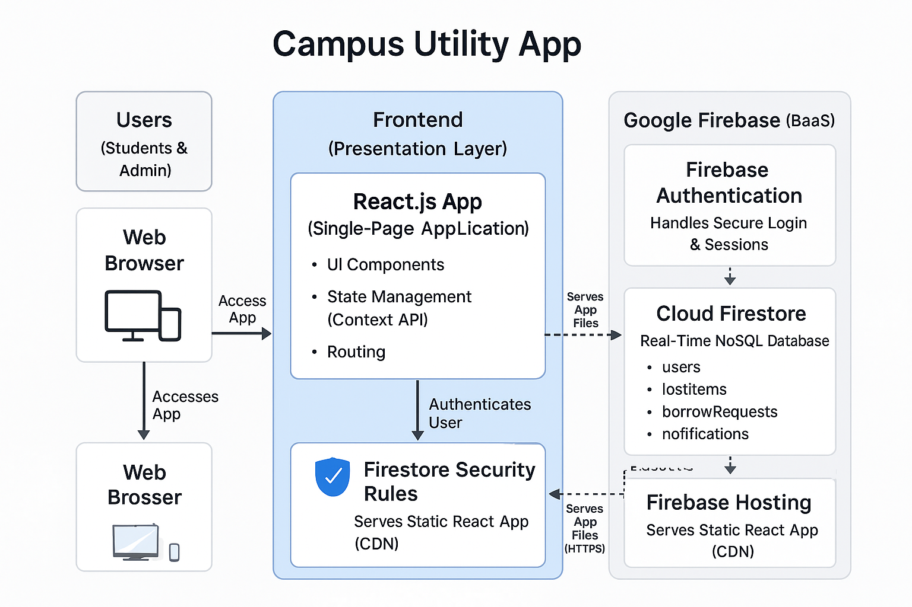

🚀 Campus Utility App

A secure, real-time web platform for the SIST campus community.
   
  
      
 

📘 Table of Contents

->Problem Statement

->Solution

->Key Features

->Technology Stack

->System Architecture

->Workflow

->Getting Started

->Future Enhancements

 
🧩 Problem Statement  

 

**Students at a busy university campus struggle with:

🎒 Lost Items

**ID cards, calculators, books, notebooks — gone, with no central system to report or recover.

📘 Borrowing Needs

->Short-term needs like:

->Lab coats

->Drafters

->Textbooks

 

❌ Current Problems

❌ Notice boards are outdated

❌ WhatsApp groups leak phone numbers

❌ Data becomes scattered and unorganized

 
💡 Solution

**A privacy-first, real-time campus utility platform with:

🔹 Lost & Found

**Central feed for lost items + private replies.

🔹 Borrowing System

**Post requests → Lenders respond privately.

🔐 No phone numbers exposed.
⚡ Real-time updates via Firestore.

 

✨ Key Features
 

🔒 Secure Login (Student + Admin)

⚡ Real-Time Lost & Found Feed

🤝 Borrow Request System

🔐 Private Notification System

📝 My Posts – Personal Dashboard

🔎 Smart Search Function

📱 Fully Responsive UI

🛡️ Admin Moderation Tools

 
🛠️ Technology Stack
 
 
->Frontend
 
->React
 
->React Router
 
->Context API
 
->Backend
 
->Firebase Authentication
 
->Cloud Firestore
 
->Firestore Security Rules
 
->Deployment
 
->Firebase Hosting (SSL + CDN)
 
 
 
🏗️ System Architecture 
 

  

 
🔄 Workflow  
 
->Lost Item Recovery Flow
 
->Owner submits a lost item
 
->Firestore stores instantly
 
->Real-time sync to all users
 
->Finder clicks Reply
 
->Private notification sent
 
->Owner retrieves item safely

 
 
🚀 Getting Started 
 
1️⃣ Clone the Repo
git clone https://github.com/YOUR_USERNAME/SIST-CAMPUS-UTILITY.git
cd SIST-CAMPUS-UTILITY

2️⃣ Install Dependencies
npm install

3️⃣ Setup Firebase

Create .env.local:

REACT_APP_API_KEY="your-key" 
REACT_APP_AUTH_DOMAIN="your-project.firebaseapp.com" 
REACT_APP_PROJECT_ID="your-project-id" 
REACT_APP_STORAGE_BUCKET="your-project-id.appspot.com" 
REACT_APP_MESSAGING_SENDER_ID="123456789" 
REACT_APP_APP_ID="1:123456789:web:abcdef123456" 

4️⃣ Start App
npm start

Open:
👉 http://localhost:3000

 
🌟 Future Enhancements 
 
📱 Native Mobile App
 
🔔 Push Notifications
 
💬 Real-Time Chat
 
🛒 Marketplace Module
 
🤖 AI-based lost item matching

 
